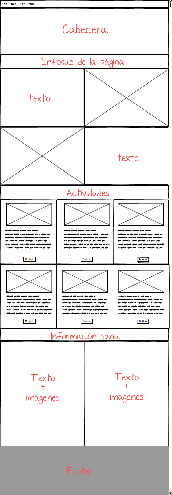
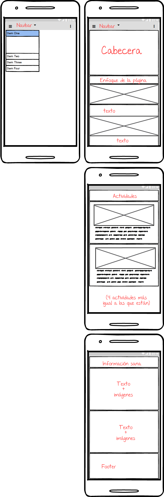

# Proyecto Final
## Vida Sana en Quilicura

### Listado con los requerimientos visuales y técnicos de la web
- Ésta página web está enfocada a la venta de tomates
- Estructura visual:
	- Fuentes
		- Delius
		- Roboto

	- Colores:
		- (#E44880)
		- (#01d194)
		- (#FF4C4C)
		- (#FAFAFA)

	- Imagenes:
		- Entregadas por cliente, sacadas personalmente y de internet. (vea carpeta "images")

### La Página web está dividida en 6 secciones (Index):

1. Navbar
2. Cabecera
3. Enfoque de la página
4. Actividades
5. Información sana
6. Footer

### Requerimientos específicos:

- Mostrará logo
- Será responsivo
- Utilización de grillas Bootstrap

### Requerimientos visuales:

- Layout : Se hará con Bootstrap
- Titulos: (fuente)
- Parrafos: (fuente)
- Banner y footer: (fuente)

### Descripción de las secciones, layout, estructura HTML y clases CSS que decidí usar.

- Navbar
	- navbar
	- navbar_logo
	- navbar_navegation
- Header
	- header
	- header_tittle
- Article
	- blog
	- blog_container
	- blogcontainer_img01
	- blogcontainer_img02

	- headersecondary
	- headersecondary_tittle

	- us
	- uscontainer
	- uscontainer_img

	- sales
	- sales_tittle
	- sales_buttom

- Footer
	- footer
	- footer_logo
	- footer_social
	- footer_list
	- footer_map

### Estructura de directorio

- **PROYECTO_FINAL**
	- README.md
	- index.html
	- assets/
		- css/
		- fonts/
		- images/
		- js/
                 
### Foto con los sketch versión escritorio y móvil.

**Versión escritorio**

**Versión móvil**
